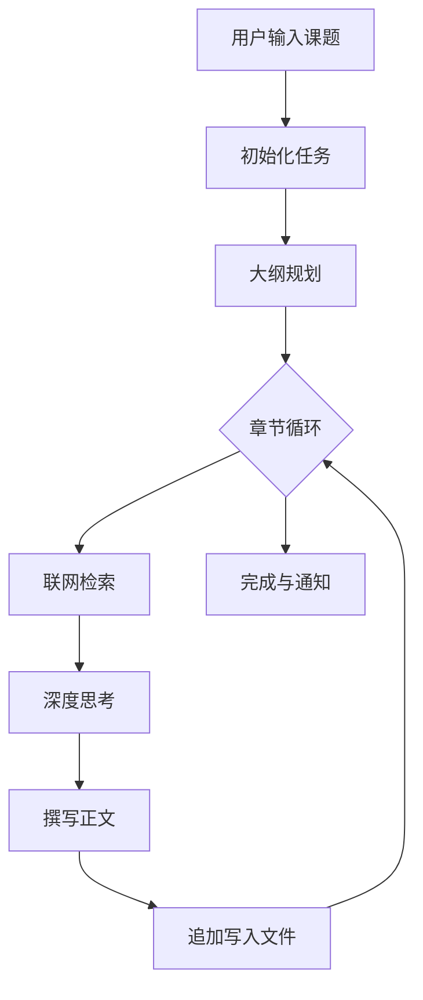

# ✨ 江军的深度报告生成AI助手 (Deep Research Web)


这是一个专为高效能知识工作者、研究人员打造的轻量级全栈 Web 应用。它通过纯 Node.js 实现了**全异步大纲生成**与**后台防 OOM 循环拆分撰写**，能够自动联网检索、深度思考并生成万字长文研究报告。全新升级的简约二次元风格界面，带来更流畅舒适的使用体验。


---

## 📑 目录

- [核心特性](#-核心特性)
- [前置准备与环境变量](#-前置准备与环境变量)
- [部署指引](#-部署指引)
- [执行流程](#-执行流程)
- [常见错误代码与问题 (FAQ)](#-常见错误代码与问题-faq)
- [参与贡献](#-参与贡献)
- [开源协议](#-开源协议)

---

## 🌟 核心特性

- 🎨 **简约二次元风格**：全新设计的 UI 界面，采用清新的色彩搭配、毛玻璃特效和流畅的动画，提供极佳的视觉体验。
- 🔐 **安全认证系统**：内置用户登录、密码修改及基于角色的权限管理（Admin/User）。
- 🤖 **AI 深度驱动**：结合大语言模型（如阿里通义千问）与博查（Bocha）搜索引擎，实现精准的联网检索与内容生成。
- 📝 **全异步流式生成**：前端触发后，后台开启异步静默线程，支持断网/锁屏生成。通过 Server-Sent Events (SSE) 实时推送执行日志。
- 🛡️ **防内存溢出 (OOM)**：采用流式追加写入本地文件系统，轻松应对万字长文，彻底解放算力。
- ⚙️ **可视化管理后台**：小白友好的 Web UI，直接在页面上配置 API Key、模型参数及系统设置。
- 📊 **本地日志管理**：系统自动记录每次报告生成的详细日志，支持在线查看、下载和一键清除。
- 👥 **多用户管理与额度控制**：管理员可创建、删除用户，并为每个普通用户分配生成报告的额度。
- 📱 **多渠道消息推送**：支持 Telegram Bot 和飞书 Webhook 实时推送任务完成通知。

---

## 🛠️ 前置准备与环境变量

在部署前，请确保您已准备好以下 API Key，并根据部署方式配置环境变量：

| 变量名 | 类型 | 说明 |
| :--- | :--- | :--- |
| `ALIYUN_API_KEY` | 必填 | 阿里百炼 API Key |
| `BOCHA_API_KEY` | 必填 | 博查搜索引擎 API Key |
| `DB_PATH` | 选填 | SQLite 数据库路径 (默认: `/app/data/database.sqlite`) |
| `PUID` | 选填 | NAS 用户 ID (默认: 1000) |
| `PGID` | 选填 | NAS 用户组 ID (默认: 1000) |

---

## 🚀 部署指引

### 1. 本地开发运行指南
如果您想在本地进行开发或调试：

```bash
# 1. 克隆代码
git clone <你的项目仓库地址>
cd deep-research-web

# 2. 安装依赖
npm install

# 3. 启动开发服务器
npm run dev
```

### 2. Docker Compose 部署 (推荐)
在 NAS 或服务器上，使用 `docker-compose.yml` 进行一键部署：

```yaml
version: '3'
services:
  deep-research:
    image: deep-research-web
    build: .
    ports:
      - "3000:3000"
    volumes:
      - ./reports:/app/reports
      - ./logs:/app/logs
      - ./data:/app/data
    environment:
      - PUID=1000
      - PGID=1000
      - DB_PATH=/app/data/database.sqlite
    restart: unless-stopped
```

运行命令：
```bash
docker-compose up -d
```

### 3. 飞牛 NAS (fnOS) 部署
请参考项目中的 `Dockerfile`，在 NAS 的 Docker 应用中挂载 `/app/reports`, `/app/logs`, `/app/data` 到本地目录即可。

---

## 🔄 执行流程



---

## 🛠️ 常见错误代码与问题 (FAQ)

| 错误模块 / 现象 | 错误代码 | 可能原因与解决方案 |
| :--- | :--- | :--- |
| **[登录模块]** 登录失败 | `401` | 账号或密码错误。 |
| **[核心调度模块]** 额度不足 | `403` | 普通用户的报告生成次数已用完。 |
| **[检索模块]** 运行失败 | `401` | 博查 API Key 错误或已过期。 |
| **[大纲/撰写模块]** 运行失败 | `404` | 大模型 Base URL 填写错误。 |
| **[大纲/撰写模块]** 运行失败 | `429` | 大模型 API 触发了并发或速率限制。 |

---

## 🤝 参与贡献

欢迎提交 Issue 或 Pull Request 来改进本项目！无论是功能建议、Bug 修复还是界面优化，我们都非常期待。

---

## ⚖️ 开源协议

本项目采用 [MIT License](LICENSE) 开源。
